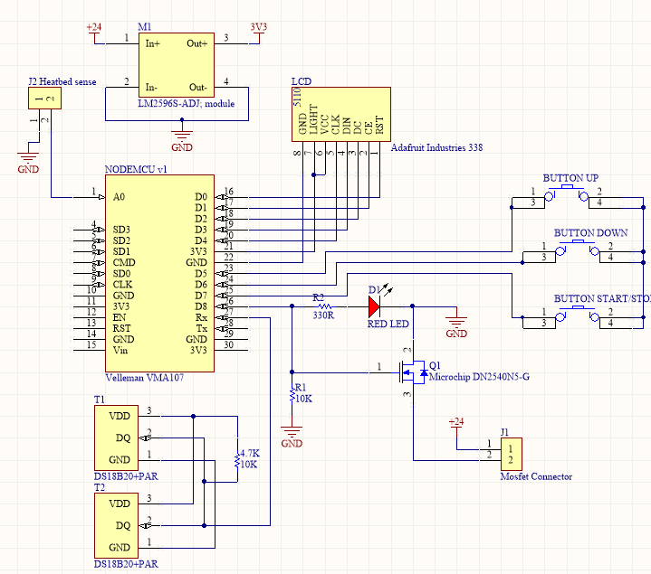
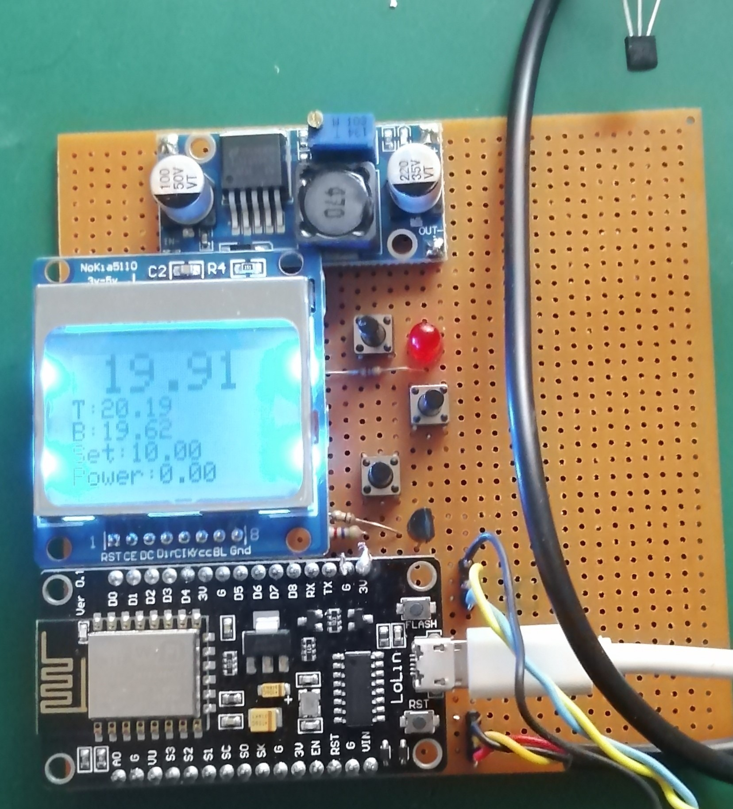

# Independent Print Chamber Temperature Control
In FDM or FFF fabrication, or 3D Printing, many materials suffer from warping issues during printing. Warping is reduced by raising the environment temperature. The common method is enclosing the printer, and cranking up the heated bed temperature.
Another method is to install additional means of heating of the enclosed chamber. Most 3D printer control boards, such as mine, however, lack additional inputs/outputs to control the chamber heating, and also lack software support. 
The presented project presents a method of independent PID temperature control of the enclosed chamber, using a NodeMCU board. The NodeMCU board is based on the ESP8266 chip, which provides basic input/outpout functionality and Wireless connectivity. 

## Functionality
A Nokia 5110 lcd display is used to display actual temperature and set value. Three buttons are used to activate heating and change the set value.
Besides the main menu, a submenu is used to control the PID constants.
The temperature is detected using two DS180B20 sensors. These cheap sensors have accurate readings, and come readily calibrated. Two separate sensors are used to measure the temperature in the top and the bottom of the print chamber. The PID controller then uses the mean value between top and bottom. The output of the PID controls a  Mosfet switching the heater.

## Heating Setup
While there are numerous ways, the basic question is to decide between low DC voltage heaters and higher voltage AC systems. Using AC has the advantage that it doesn't require a dc power supply. 

### AC Heater
An AC load can be switched using an solid state relay (SSR). This uses a dc low voltage signal to switch the relay. However, it has to be reminded that a SSR only changes its state ant the zero crossings. The switching frequency is therefore limited by the AC base frequency.

### DC Heater
This allows faster and easier control of the load, since Mosfets can control loads at very high frequencies. It has the drawback of requiring a powersupply capable of driving high currents.

## Printer integration
Since this setup is independent of the rest of the printers control hardware, it would continue heating after a print has finished. This is undesirable when leaving the printer unattended. 
For this reason we implemented an input which uses the control ouput of the bed heater. Each time the bed heating is switched on, a timer is reset. The timer counts up against a timeout. If the timout is exceeded, the chamber heating is switched off. 
Activation is done manually prior to start of print, using the menu buttons.

## Safety measures

- min_temp
- max_temp
- sensor timeout

# Hardware Components
- NodeMCU
- Nokia 5110 LCD display
- n-channel mosfet
- DS180B20 temperature sensor

# Prototype

